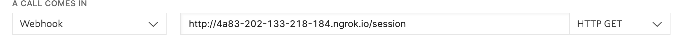

# Install 
1. 
````bash
npm install
````
2. Update initDB.js with test numbers (proxy, customer, driver)
3. Run initDB.js once 
4. Create and populate .env file based on .env.sample 
5. The Twilio proxy numbers webhook should point to the public url of the server, using HTTP GET

6. 
````bash
cd server && nodemon app.js 
````
# Usage
1. Create session -> Get proxy phone number
2. Call the proxy phone number from the customer or driver and the call will be forwarded accordingly. 
